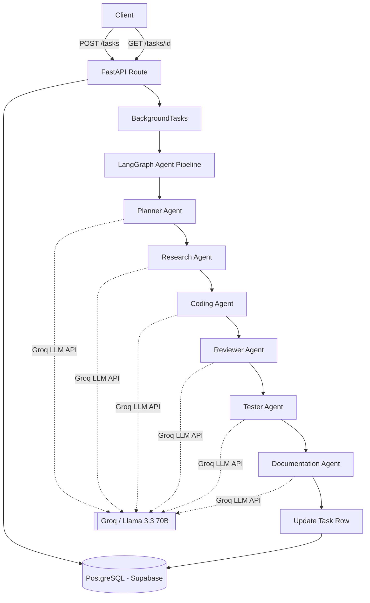

# 🤖 Multi-Agent AI Software Engineer

A production-grade multi-agent system where six specialized AI agents collaborate — planning, researching, coding, reviewing, testing, and documenting — to turn a single natural-language request into a complete, tested, documented software artifact.

> ⚠️ **Live demo:** `<PASTE_YOUR_RENDER_URL_HERE>/docs` — *(fill this in once Step 21 deployment is complete; free-tier services sleep after 15 min of inactivity, so the first request may take 30-60s to wake up)*

---

## 🧠 What This Is

Instead of a single LLM call, this system models real software engineering as a **pipeline of collaborating agents**, orchestrated with **LangGraph**:

```
User Prompt
    │
    ▼
┌─────────────┐
│ Planner     │  Breaks the request into ordered subtasks
└──────┬──────┘
       ▼
┌─────────────┐
│ Research    │  Gathers relevant technical context & best practices
└──────┬──────┘
       ▼
┌─────────────┐
│ Coding      │  Writes working Python code
└──────┬──────┘
       ▼
┌─────────────┐
│ Reviewer    │  Critically reviews the code for bugs & issues
└──────┬──────┘
       ▼
┌─────────────┐
│ Tester      │  Writes pytest unit tests, informed by the review
└──────┬──────┘
       ▼
┌─────────────┐
│ Documentation│  Writes developer-facing docs for the result
└──────┬──────┘
       ▼
  Final Output
```

Each agent reads from and writes to a **shared state object**, so every agent has full context of everything that ran before it — not just the immediately preceding step.

---

## 🏗️ Architecture Diagram



---

## 🛠️ Tech Stack

| Layer | Technology |
|---|---|
| **API Framework** | FastAPI (async) |
| **Agent Orchestration** | LangGraph |
| **LLM Provider** | Groq (Llama 3.3 70B) |
| **Database** | PostgreSQL (Supabase-hosted) |
| **ORM / Migrations** | SQLAlchemy (async) + Alembic |
| **Testing** | pytest, pytest-asyncio, httpx (mocked DB/LLM calls) |
| **Containerization** | Docker + Docker Compose |
| **CI/CD** | GitHub Actions |
| **Deployment** | Render |
| **Config** | Pydantic Settings + `.env` |

---

## 📁 Project Structure

```
ai-software-engineer/
│
├── app/
│   ├── agents/          # One file per AI agent (planner, research, coding, etc.)
│   ├── api/routes/       # FastAPI route handlers
│   ├── core/             # Config + logging setup
│   ├── database/         # SQLAlchemy engine/session setup
│   ├── graph/            # LangGraph state, nodes, and workflow definition
│   ├── migrations/       # Alembic migration scripts
│   ├── models/           # SQLAlchemy ORM models
│   ├── prompts/          # System prompts, one per agent
│   ├── schemas/          # Pydantic request/response schemas
│   ├── services/         # Business logic layer (task_service.py)
│   └── main.py           # FastAPI app entrypoint
│
├── tests/                # Pytest suite (mocked DB + LLM)
├── .github/workflows/    # CI pipeline
├── Dockerfile
├── docker-compose.yml
├── requirements.txt
└── .env.example
```

---

## 🚀 Getting Started Locally

### Prerequisites
- Python 3.12+
- A free [Groq API key](https://console.groq.com)
- A free [Supabase](https://supabase.com) project (PostgreSQL)

### Installation

```bash
git clone https://github.com/Ga-lib/ai-software-engineer.git
cd ai-software-engineer

python -m venv venv
venv\Scripts\Activate.ps1        # Windows
# source venv/bin/activate       # Mac/Linux

pip install -r requirements.txt
```

### Configuration

```bash
cp .env.example .env
```

Fill in `.env` with your real Groq API key and Supabase connection string (see `.env.example` for the required format).

### Run database migrations

```bash
alembic upgrade head
```

### Run the app

```bash
uvicorn app.main:app --reload
```

Visit `http://127.0.0.1:8000/docs` for interactive API documentation.

### Run tests

```bash
pytest -v
```

### Run with Docker

```bash
docker compose up
```

---

## 📡 API Reference

| Method | Endpoint | Description |
|---|---|---|
| `GET` | `/health` | Liveness check |
| `GET` | `/health/db` | Verifies database connectivity |
| `POST` | `/tasks` | Submits a request; agent pipeline runs in the background |
| `GET` | `/tasks/{id}` | Fetches a task's current status/result |
| `GET` | `/tasks` | Lists recent tasks |

**Example request:**

```bash
curl -X POST http://127.0.0.1:8000/tasks \
  -H "Content-Type: application/json" \
  -d '{"prompt": "Write a Python function that checks if a number is prime"}'
```

**Response fields include:** `status` (`pending` → `planning` → `researching` → `completed`/`failed`), `plan`, `research_notes`, `generated_code`, `review_notes`, `test_results`, `documentation`, and a combined `result` field.

---

## 🧪 Testing Strategy

The test suite deliberately **mocks the database and LLM calls** rather than hitting real services:

- Fast (runs in well under a second)
- Free (no Groq API usage per test run)
- Deterministic (no flaky network dependency)
- CI-friendly (runs the same way locally and on GitHub Actions)

Real end-to-end verification happens via manual testing against a live Supabase + Groq connection, and via the deployed Render instance.

---

## 🖼️ Screenshots

*(Add these once you have them)*

- [ ] Swagger UI showing all endpoints (`/docs`)
- [ ] A completed task response showing all 6 agent output sections
- [ ] Supabase Table Editor showing the `tasks` table with a completed row
- [ ] GitHub Actions tab showing a green CI run
- [ ] Render dashboard showing the live deployed service

---

## 📄 License

MIT